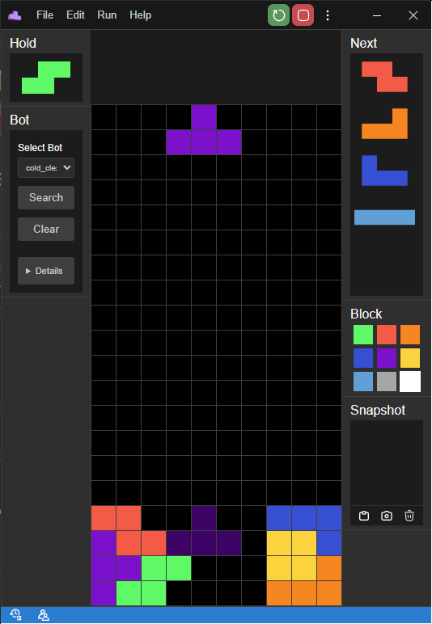
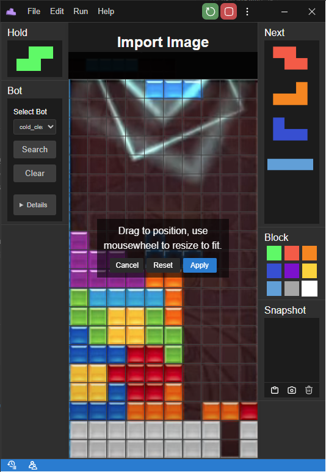
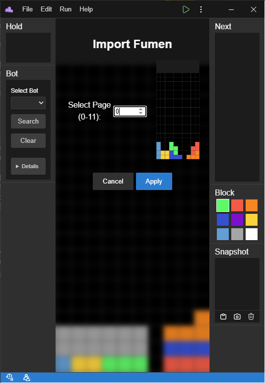

# fumen-rs

<div align="center">

 <a>
    <picture>
      <source height="125" media="(prefers-color-scheme: dark)" srcset="./static/128x128.png">
      
    </picture>
  </a>
  </br>

  <a>
    
    </a>
  <a>
      
  </a>

</br>
   <a>
    <picture>
      <source height="300" media="(prefers-color-scheme: dark)" srcset="./static/thumbnail.png">
      
    </picture>
  </a>
</div>

## Table of Contents

- [Features](#features)
- [Installation Instructions](#installation-instructions)
  - [Portable Version](#portable-version)
  - [Installer Version](#installer-version)
  - [Changing Block Images](#changing-block-images)
- [Build Instructions](#build-instructions)
- [Directory Structure](#directory-structure)
- [for Developer](#for-developer)
  - [Adding Bot DLLs](#adding-bot-dlls)
  - [Adding Image Recognition](#adding-image-recognition)
- [License](#license)
- [Contact](#contact)
- [Support](#support)

## Features

<details>
  <summary>Assistance with Bots</summary>
  The application supports custom bot integration, allowing you to analyze scenarios using bots. By default, the application includes `cold-clear.dll` for analysis. Refer to the [Adding Bot DLLs](#adding-bot-dlls) section for detailed instructions on adding your own bots.
  </details>

<details>
  <summary>Online Fumen Analysis</summary>
  Share and collaboratively edit fumen in real-time.
</details>

<details>
  <summary>Fumen Image Recognition</summary>
  Basic image recognition capabilities for fumen analysis. Currently, only PPT default images are supported, with more images under development.

   <picture>
      <source height="300" media="(prefers-color-scheme: dark)" srcset="./static/imageRecog.png">
      
    </picture>
</details>

<details>
  <summary>Compatible with Fumen</summary>
  Fully compatible with the fumen format, enabling seamless integration and analysis of fumen data.

   <picture>
      <source height="300" media="(prefers-color-scheme: dark)" srcset="./static/fumenRecog.png">
      
    </picture>
</details>

<details>
  <summary>History Tracking</summary>
  Keep track of your edit history within the application. This feature allows you to undo and redo.
</details>

## Installation Instructions

### Portable Version

For the portable version, you need to install WebView2. You can download it from the official Microsoft website: [WebView2 Runtime](https://developer.microsoft.com/en-us/microsoft-edge/webview2/).

### Installer Version

For the installer version, simply run the installer. The application will be installed in the following directory:

```
%LOCALAPPDATA%\fumen-rs
```

### Changing Block Images

To change the block images, replace the files in the `assets/images` folder located in the installation directory.

```
assets\images
```

After replacing the images, restart the application to apply the changes.

## Build Instructions

To build the project, ensure you have Rust installed. Additionally, register the Tetris-related npm package locally before proceeding with the Rust build. Follow these steps:

1. Clone the repository:

  ```bash
  git clone https://github.com/CSDotNET0211/fumen-rs.git
  cd fumen-rs
  ```

2. Clone and build the Tetris npm package:

  ```bash
  git clone https://github.com/CSDotNET0211/tetris.git
  cd tetris
  npm install
  npm run build
  npm link
  cd ..
  ```

3. Link the Tetris package to the project:

  ```bash
  npm link tetris
  ```

4. Build the Rust project:

  ```bash
  cargo build --release
  ```

This process ensures the project is properly set up for both npm and Rust-based integrations.

## Directory Structure

The following is an overview of the project's directory structure:

- **src/components/**: Components related to the UI display.
- **src/registry/**: Registration of commands and shortcuts loaded at startup.
- **src/routes/**: Window management.
- **src/translations/**: Language translations.

## for Developers

### Adding Bot DLLs

To add custom bot DLLs:

1. Implement the bot logic in a DLL file. For example, you can use the following function signature for a bot search function.
2. Place the DLL files in the `assets/bots/` directory.
3. Restart the application to load the new bots.

 <details>
  <summary>How to make DLLs</summary>

  ```rust
  unsafe extern "C" fn cc_search(
    field: *const std::os::raw::c_char,
    hold: *const std::os::raw::c_char,
    b2b: bool,
    combo: u32,
    pieces: *const std::os::raw::c_char,
    incoming: u32,
    result: *mut [u8; 9])
  ```

- **field**: A pointer to the current field state as a C-style string.  
    Example:  
    `"10111111110001111111100000000000000000000000000000000000000000000000000000000000000000000000000000000000000000000000000000000000000000000000000000000000000000000000000000000000000000000000000000000000000000000000000000000000000000"`

- **hold**: A pointer to the hold piece as a C-style string.  
    Example:  
    `"t"` (or `"empty"` if no piece is held)

- **b2b**: A boolean indicating whether the back-to-back bonus is active.  
    Example: `true`

- **combo**: The current combo count.  
    Example: `3`

- **pieces**: A pointer to the sequence of upcoming pieces as a C-style string.  
    Example: `"szjltoi"`

- **incoming**: The number of incoming garbage lines.  
    Example: `5`

- **result**: A mutable pointer to an array where the bot's decision block status will be stored.  
    `[minoType, block1 x, block1 y, block2 x, block2 y, block3 x, block3 y, block4 x, block4 y]`

  </details>

### Adding Image Recognition

Under construction.
</br>
only ppt default image is supported.

## License

This project is licensed under the MIT License. See the [LICENSE](./LICENSE) file for details.

## Contact

For questions or discussions, join our Discord server: [Discord Invite Link](https://discord.gg/F958vMFfcV).

## Support

If you enjoy this project and want to support its development, consider buying me a coffee on Ko-fi
<br>
<a href='https://ko-fi.com/A0A5FQPRZ' target='_blank'></a>
